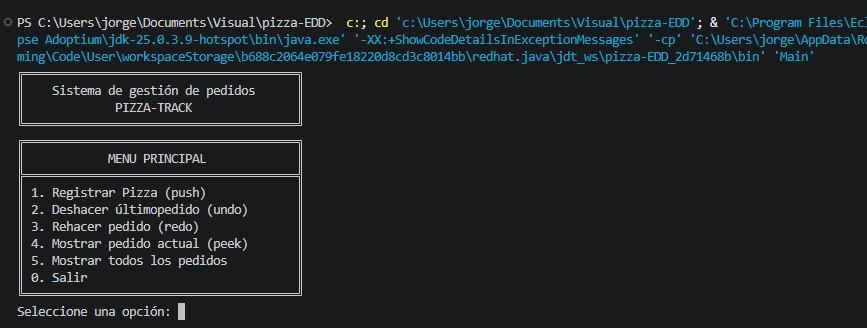

# pizza-EDD
Simulador de gestión de pedidos (Undo/Redo) para una pizzería, implementado en Java. La actividad busca evaluar la capacidad del estudiante para combinar estructuras (arreglos y listas ligadas), trabajar coordinadamente en equipo y aplicar buenas prácticas de control de versiones mediante GitHub.

El objetivo de la actividad es crear una estructura de arreglos y listas para almacenar datos fijos y temporales, donde se pueden deshacer y rehacer, consultar e interactuar por el menu principal 

IMAGENES DE TERMINAL EN DIFERENTES PROCESOS

    -Menu principal 
    
    -Registro del primer pedido 
    (images/registro 1.png)
    -Registro del segundo pedido
    (images/registro 2.png)